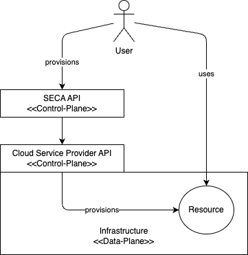
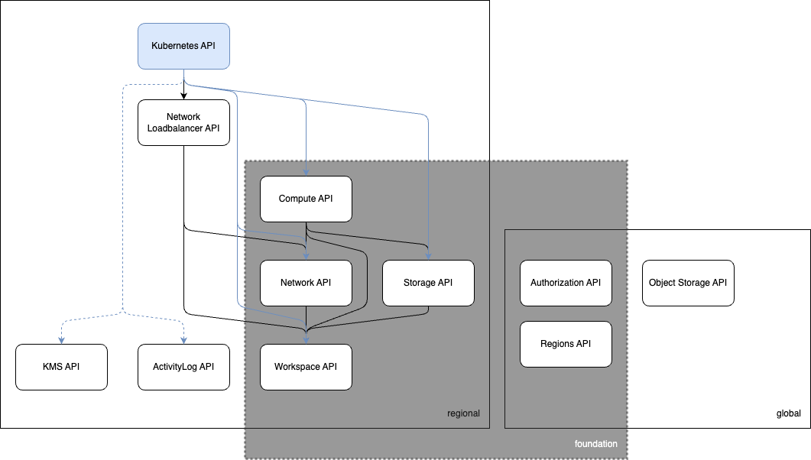

# SECA - Sovereign European Cloud API

## Mission

Unite top European providers to create a European cloud standard attracting the public sector.

## Key advantages

* sovereignty, e.g. immunity from foreign government interference keeping API control with founding members
* common standards reduces costs, e.g. less training, common tooling, faster adoption, …
* broad provider support will incentivize ISVs to build profitable tools and software ecosystems
* build-in alignment with EU regulations for resilience, data protection and privacy
* long-term support of APIs provide reliability and maintainability
* comparison of compliant providers and increased resources using multiple providers
* directly address the demand of the public sector to have no vendor login

## Open Development Model

The SECA API is designed with extensibility in mind, allowing for the seamless integration of new products and features as they emerge. To facilitate this, the API framework is open to proposals from any member of the SECA community. Members can submit suggestions for new features, enhancements, or extensions to the API council, which will review and evaluate them based on the established API guidelines. This collaborative approach ensures that the SECA API remains adaptable, innovative, and aligned with the evolving needs of its users, while maintaining the integrity and consistency of the API framework.

## High Level architecture

The SECA API is designed with a clear separation of concerns, dividing its architecture into two distinct planes: the Control-Plane and the Data-Plane. This design allows for flexibility in implementation, supporting both regional and fully-global API deployment strategies.

The Control-Plane serves as the management interface, handling resource creation, configuration, and provisioning. In contrast, the Data-Plane provides customers with access to their provisioned resources, enabling them to utilize the allocated services.

A key principle of the SECA API is its adaptability, allowing implementers to deploy it regionally or globally, depending on their specific requirements. To achieve this, resources are separated by provider, with provider-specific APIs defined to operate at either a regional or global scope.

By building upon existing Cloud Service Provider APIs, the SECA API facilitates a seamless integration with established cloud infrastructure, enabling a more efficient and streamlined deployment process.

## Foundation Compliance

To achieve foundation compliance, a Cloud Service Provider (CSP) must implement the necessary providers to establish a foundational Infrastructure-as-a-Service (IaaS) layer. This involves deploying a comprehensive set of providers that enable the creation and management of essential resources.

New CSPs can ideally achieve foundation compliance within a short timeframe by implementing the required providers from scratch. Alternatively, existing CSPs with pre-existing APIs can leverage these to expedite the compliance process. In such cases, a simple API proxy or translator can be employed to map the control plane resources, enabling seamless integration with the SECA API framework. This approach minimizes the need for extensive re-architecture, allowing CSPs to rapidly adapt to the SECA standard.

## TODO Products / Functionalities

This is the first release of the SECA API.

For this release we decided to restrict the scope of the API to take in consideration only a small subset of operations; this will allow us to provide a correct API interface, documentation, and examples.

## Guidelines

In the modern landscape of cloud computing, APIs serve as the backbone for enabling seamless integration between services, applications, and platforms. When designing and developing APIs for the cloud, it’s essential to focus on scalability, security, and flexibility to support a wide range of client applications. This chapter provides comprehensive guidelines on how to design robust, scalable cloud APIs that align with industry best practices.

In this chapter we aim to cover key principles such as RESTful architecture, API versioning, backward compatibility, and security considerations, along with strategies to design cloud resources. Whether building APIs for internal use or exposing them to third-party developers, these practices will help create APIs that are easy to use, maintain, and evolve over time.

### Resource Design

The aim of this document is to define guidelines to design resource model for the SECA APIs.

* [Architecture](./docs/resource-guidelines/02-architecture.md)
* [Control Plane Specification](./docs/resource-guidelines/03-control-plane-specification.md)
* [Resource Organization](./docs/resource-guidelines/04-resource-organization.md)
  * [Tenant](./docs/resource-guidelines/04-resource-organization.md#tenant)
  * [Workspace](./docs/resource-guidelines/04-resource-organization.md#workspace)
  * [Cloud Resource](./docs/resource-guidelines/04-resource-organization.md#cloud-resource)
* [API Access Control](./docs/resource-guidelines/05-api-access-control.md)
  * [Authentication](./docs/resource-guidelines/05-api-access-control.md#authentication)
  * [Authorization](./docs/resource-guidelines/05-api-access-control.md#authorization)
    * [Role](./docs/resource-guidelines/05-api-access-control.md#role)
    * [RoleBinding](./docs/resource-guidelines/05-api-access-control.md#rolebinding)
    * [TenantRole](./docs/resource-guidelines/05-api-access-control.md#tenantrole)
    * [TenantRoleBinding](./docs/resource-guidelines/05-api-access-control.md#tenantrolebinding)
  * [Admission Control](./docs/resource-guidelines/05-api-access-control.md#admission-controller)
* [Resource Model](./docs/resource-guidelines/06-resource-model.md)
  * [Resource Definition](./docs/resource-guidelines/06-resource-model.md#resource-definition)
    * [Metadata](./docs/resource-guidelines/06-resource-model.md#metadata)
    * [Properties](./docs/resource-guidelines/06-resource-model.md#properties)
    * [Status](./docs/resource-guidelines/06-resource-model.md#status)
  * [Resource Lifecycle](./docs/resource-guidelines/06-resource-model.md#resource-lifecycle)

### Api Conventions

* [Core Principles](./docs/resource-guidelines/02-core-principles.md)
* [API Security](./docs/resource-guidelines/03-api-security.md)
  * [Authentication](./docs/resource-guidelines/03-api-security.md#authentication)
  * [Authorization](./docs/resource-guidelines/03-api-security.md#authorization)
* [Core API Concepts](./docs/resource-guidelines/04-core-api-concepts.md)
  * [Entity](./docs/resource-guidelines/04-core-api-concepts.md#entity)
  * [Relationship](./docs/resource-guidelines/04-core-api-concepts.md#relationship)
    * [Composition & Aggregation](./docs/resource-guidelines/04-core-api-concepts.md#composition--aggregation)
    * [Cardinalities](./docs/resource-guidelines/04-core-api-concepts.md#cardinalities)
  * [URI Naming Convention](./docs/resource-guidelines/04-core-api-concepts.md#uri-naming-convention)
* [Operations and HTTP Methods](./docs/resource-guidelines/05-operations-and-http-methods.md)
* [HTTP Semantics](./docs/resource-guidelines/06-http-semantics.md)
  * [Media Type](./docs/resource-guidelines/06-http-semantics.md#media-type)
    * [JSON](./docs/resource-guidelines/06-http-semantics.md#json)
      * [Casing](./docs/resource-guidelines/06-http-semantics.md#casing)
      * [Naming](./docs/resource-guidelines/06-http-semantics.md#naming)
      * [Type Conversion](./docs/resource-guidelines/06-http-semantics.md#type-conversion)
  * [GET Method](./docs/resource-guidelines/06-http-semantics.md#get-method)
  * [HEAD Method](./docs/resource-guidelines/06-http-semantics.md#head-method)
  * [PUT Method](./docs/resource-guidelines/06-http-semantics.md#put-method)
  * [POST Method](./docs/resource-guidelines/06-http-semantics.md#post-method)
  * [PATCH Method](./docs/resource-guidelines/06-http-semantics.md#patch-method)
  * [DELETE Method](./docs/resource-guidelines/06-http-semantics.md#delete-method)
  * [Conditional Requests](./docs/resource-guidelines/06-http-semantics.md#conditional-requests)
  * [Status Code](./docs/resource-guidelines/06-http-semantics.md#status-code)
    * [Group By Category](./docs/resource-guidelines/06-http-semantics.md#group-by-category)
    * [Status Detail](./docs/resource-guidelines/06-http-semantics.md#status-detail)
    * [Problem Details - Response Body for 4xx and 5xx Categories](./docs/resource-guidelines/06-http-semantics.md#problemdetails---response-body-for-4xx-and-5xx-categories)
* [API Enhancements](./docs/resource-guidelines/07-api-enhancements.md)
  * [Filtering](./docs/resource-guidelines/07-api-enhancements.md#filtering)
  * [Pagination](./docs/resource-guidelines/07-api-enhancements.md#pagination)
* [Versioning](./docs/resource-guidelines/07-api-enhancements.md#versioning)
* [Asynchronous Operations](./docs/resource-guidelines/09-asynchronous-operations.md)
  * [Asynchronous Request-Reply Pattern](./docs/resource-guidelines/09-asynchronous-operations.md#asynchronous-request-reply-pattern)
  * [Solution](./docs/resource-guidelines/09-asynchronous-operations.md#solution)
  * [Considerations and Issues](./docs/resource-guidelines/09-asynchronous-operations.md#considerations-and-issues)
  * [When should you use this model?](./docs/resource-guidelines/09-asynchronous-operations.md#when-should-you-use-this-model)

### Other

* [Calculate Compute Score](./docs/others/calculate-compute-score.md)
* [Glossary](./docs/others/glossary.md)

## Plan

### SECA Foundation (v1) **WIP**

* [ ] Compute
  * [x] SKU
  * [x] Quota
  * [x] Select a Cloud Server Flavour
  * [x] SECA t-shirt size
  * [x] Provider size/type
  * [x] Use Cloud Init to initialize the Cloud Server
  * [x] Use the API to set up the ssh Public-Key for the Cloud Server
  * [x] Assign a SCI to a Subnet
  * [ ] Group
  * [ ] SSH Keys
* [ ] Network
  * [x] SKU
  * [x] Quota
  * LAN
    * [x] Set up a LAN
    * [x] Will be a logical container for the Subnets, all the Subnets inside a LAN will have the same Gateway
  * Subnet
    * [x] Set up a Subnet
    * [x] Specify the CIDR for the Subnet
    * [x] In this version the DHCP will always be active
    * [x] IP range cannot be updated once the Subnet is set up
  * Security Group and Security Group Rules
    * [x] Create a Security Group to be attached to a NIC
    * [x] Create Security Group Rules allow traffic on certain ports from/to certain networks/Security Groups
  * Public IP
    * [x] Reserve a Public IP address
    * [x] Assign the Public IP address to a NIC
  * [ ] Routing API
* [x] Storage
  * [x] SKU
  * [x] Quota
  * [x] Select a Block Storage type and size
  * [x] A bootable BS will be generated by Image+BS
  * [x] In this version only one Connection Type will be available (iSCSI)
  * [x] Be able to attach more than one disk to the same SCI
  * [x] Be able to select an image
  * [x] Images are going to be provided by the ISP
* [x] Workspace
  * [x] Create one or more Workspace/s
* [ ] Regions
  * [ ] Basic API
* [ ] Authorization
  * [ ] Basic API

### SECA Object-Storage (v1) **WIP**

* [ ] SKU
* [ ] Basic API

### SECA Load-Balancer (v1) **WIP**

* [ ] SKU
* [ ] Basic API

### SECA Activity-Log (v1) **WIP**

* [ ] SKU
* [ ] Basic API

### SECA KMS (v1) **TODO**

* [ ] SKU
* [ ] Basic API

### SECA Kubernetes (v1) **TODO**

* [ ] SKU
* [ ] Basic API
