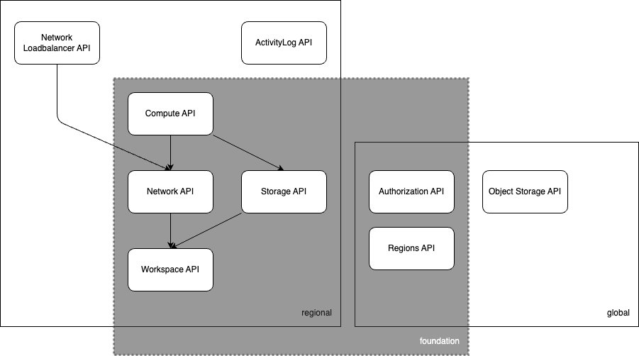

# SECA - Sovereign European Cloud API

## Mission

Unite top European providers to create a European cloud standard attracting the public sector.

## Key advantages

* sovereignty, e.g. immunity from foreign government interference keeping API control with founding members
* common standards reduces costs, e.g. less training, common tooling, faster adoption, …
* broad provider support will incentivize ISVs to build profitable tools and software ecosystems
* build-in alignment with EU regulations for resilience, data protection and privacy
* long-term support of APIs provide reliability and maintainability
* comparison of compliant providers and increased resources using multiple providers
* directly address the demand of the public sector to have no vendor login

## Open Development Model

The SECA API is designed to be extended by any upcoming product and features. Proposals
to the API council can be made by any member and will be taken for admission following the API
guidelines.

## High Level architecture+

The SECA API is separated into Control-Plane and Data-Plane and supports a
regional or fully-global API design philosophy.

The Control-Plane is managing the resources. The Data-Plane provides the
customer with the provisioned resources.

The APIs philosophy demands that the API can be implemented regionally, but
must not be. It may also be implemented globally. In order to do that all
resources are separated by providers these provider APIs are defined to be
regional or global in nature.

## Foundation Compliance

The foundation compliance can be achieved by implementing all providers that
are needed to provide a foundational IaaS layer.

This foundation compliance is ideally implemented by a new CSP (cloud service
provider) within a short time frame. If the CSP already has APIs to create
the described resources a simple API proxy / translator might be able to
map the control plane resources.

## TODO Products / Functionalities

### SECA Foundation (v1) **WIP**

* [ ] Compute
  * [x] SKU
  * [x] Quota
  * [x] Basic API
  * [ ] Group
  * [ ] SSH Keys
* [ ] Network
  * [x] SKU
  * [x] Quota
  * [x] Basic API
  * [ ] Routing API
* [x] Storage
  * [x] SKU
  * [x] Quota
  * [x] Basic API
* [x] Workspace
  * [x] Basic API
* [ ] Regions
  * [ ] Basic API
* [ ] Authorization
  * [ ] Basic API

### SECA Object-Storage (v1) **WIP**

* [ ] SKU
* [ ] Basic API

### SECA Load-Balancer (v1) **WIP**

* [ ] SKU
* [ ] Basic API

### SECA Activity-Log (v1) **WIP**

* [ ] SKU
* [ ] Basic API

### SECA KMS (v1) **TODO**

* [ ] SKU
* [ ] Basic API

### SECA Kubernetes (v1) **TODO**

* [ ] SKU
* [ ] Basic API
