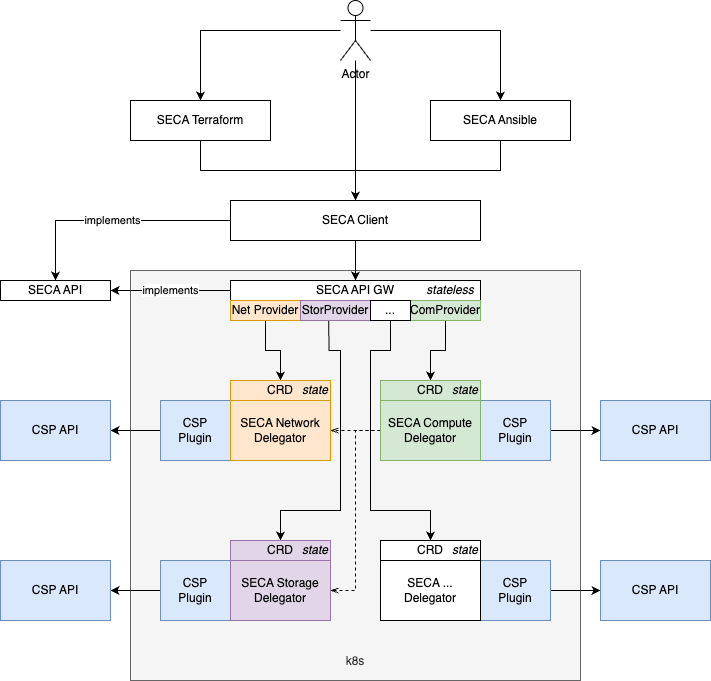

# Architecture

Cloud Requests can be divided in two categories **Control-Plane** and **Data-Plane**.

## Control-Plane

Those APIs are used to create and manage cloud resources in a specific tenant. The
Control-Plane APIs are responsible for managing resources and returning configurations,
such as metadata, resource properties, and states. The resources managed by
Control-Plane APIs follow a standardized resource schema.

To ensure compatibility of the SECA API across all providers, a common API server is
implemented. This API server serves as a frontend to a set of shared delegators, which
handle the implementation of resource provisioning according to the SECA API specifications.
The delegators, in turn, delegate the actual implementation to the respective Cloud Service
Provider (CSP) plugin, enabling seamless integration and compatibility.

## Data-Plane

When interacting with cloud resources, requests for Data-Plane operations are directed to an
instance-specific endpoint, enabling direct interaction with the actual data or services
provided, such as object storage or databases. The primary function of Data-Plane APIs is to
manage and return data, encompassing files, query results, and responses to data manipulation
requests. Due to the diverse nature of data types and service objects, including NFS, SQL,
Key/Value, and Vaults, the schemas for Data-Plane APIs exhibit significant variability.
Unlike other APIs that focus on metadata or configuration, Data-Plane APIs are exclusively
concerned with operating on actual data, facilitating its retrieval, manipulation, and
return. **It is important to note that Data-Plane APIs serve a unique purpose within the cloud
ecosystem and, as such, fall outside the scope of the SECA API**.
