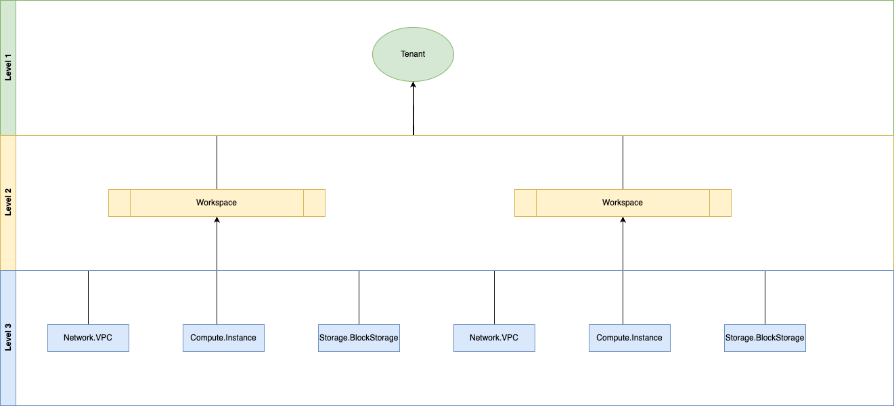

# Resource Organization

A cloud organization model is a framework that defines how an organization structures, manages, and governs its resources, users, and permissions within a cloud environment

## Tenant

A tenant refers to a logical, isolated space created within the cloud environment that is dedicated to a specific organization, user, or customer. This isolation allows multiple customers (tenants) to share the cloud provider’s infrastructure while maintaining security, privacy, and data separation.

Key Aspects of this concept are described below:

- **Isolation**: Each tenant has a distinct, segregated environment that separates their resources and data from those of other tenants.
- **Resource Ownership and Management**: Within a tenant, an organization has ownership over the resources they provision, such as virtual machines, databases, networks, and storage. Tenants are responsible for managing these resources within the confines of their isolated environment.
- **Security**: Tenants have their own access controls settings, which prevent unauthorized access and maintain data privacy. Roles and permission management offers resource based access. control (rbac)
- **Billing and Usage Tracking**: Each tenant has separate billing, with usage tracking that enables the cloud provider to charge tenants based on their resource consumption.

For SECA, the creation of the tenant is not standardized. Billing and usage tracking are out of scope for SECA.

## Workspace

A workspace is a specific, scoped environment within a tenant that groups related resources for collaborative or organizational purposes. Workspaces are often designed to help organize resources for distinct projects, teams, or applications, and they simplify management within a larger tenant.

Key Aspects of this concept are described below:

- **Scoped Environment**: A workspace provides a bounded environment within a tenant where resources, configurations, and settings are applied to a specific set of workloads, applications, or team needs. This allows focused management and separation within the broader tenant context.
- **Resource Grouping**: Workspaces allow related resources—such as virtual machines, storage, applications, and configurations to be grouped together for easier organization, lifecycle management, and monitoring.
- **Collaboration and Permissions**: Workspaces often have configurable access controls, enabling teams to manage permissions specific to the workspace. This is useful for collaborative environments where different teams or users work within the same tenant but require specific access.
- **Billing and Usage Tracking**: Many cloud providers allow resource usage within a workspace to be tracked separately, making it easier to allocate costs to specific projects or teams.
- **Configuration and State Management**: Workspaces may include settings, variables, and secrets specific to the resources they contain, allowing consistent configurations across different environments (e.g., development, testing, production).

## Cloud Resource

A Cloud Resource represents a distinct, managed service or component that is provisioned, configured, and controlled by a resource provider (earlier mentioned as `resourceProviderWorkspace`). Each cloud resource in this model is managed through a unified API that defines its lifecycle, configuration, and access policies. This allows consumers to interact consistently across IaaS, PaaS, and SaaS resources, despite their differing levels of abstraction.

The Key characteristics of the cloud resource are reported below:

- **Unified Resource Interface** - Each cloud resource in the model follows a standardized API schema, enabling consistent creation, management, and deletion across layers; the API typically includes endpoints for lifecycle management (create, update, delete) allowing seamless integration and automation.
- **Region Awareness** - Region awareness in a cloud resource model refers to the capability of cloud resources to recognize and act upon their geographic, network, or logical region within the cloud provider's infrastructure. This awareness is crucial for optimizing performance, regulatory compliance, cost management, and data residency requirements, as well as for providing better user experiences
  - we define **global**, **regional**, and **zonal** resources
- **Service Layer** - there is no difference about the provisioned service layer to the customer so IaaS, PaaS, or SaaS, resources are modeled with the same standard specification.
- **Resource Provider** - A resource provider is responsible for creating, managing, and maintaining cloud resources across the service layers (IaaS, PaaS, SaaS). It handles resource provisioning ensuring that users can interact with resources through the standardized API without worrying about the underlying infrastructure. Examples: 'seca.network', 'seca.compute'.
- **Lifecycle Management** - Cloud resources are managed through defined states and transitions, such as active, creating, updating, deleting, deleted. Standardized lifecycle events ensure predictable behavior, allowing consumers to automate deployment and scaling processes across resources.
- **Configuration and Customization** - Each resource can be configured according to its type and purpose. For IaaS resources, this might mean selecting compute size and storage; for PaaS, it might involve setting runtime parameters; and for SaaS, it might include user and permission management.

In a Cloud Resource Model API, a cloud resource is any standardized, provider-managed service available through IaaS, PaaS, or SaaS layers. Each resource adheres to a unified API interface for consistent lifecycle management, configuration, access control, and monitoring, allowing users to interact seamlessly across various cloud service layers.

Infrastructure-as-a-Service (IaaS) operations are inherently asynchronous due to the time required to provision and configure physical or virtualized resources. When a request is made to create, modify, or delete an IaaS resource (such as a virtual machine, storage volume, or network interface), the API immediately returns a response, while the actual work continues in the background. Clients must poll the operation status endpoint to track the progress and eventual completion of these long-running tasks, ensuring robust handling of provisioning delays, failures, and rollback scenarios.

Client-scoped resource naming provides a powerful advantage in asynchronous cloud environments by enabling predictable resource referencing before creation is complete. When clients define resources using their own scope and naming convention (e.g., "workspace/my-app/network/vpcs/primary-vpc"), dependent resources can immediately reference this deterministic identifier without waiting for the actual resource creation to finish. This pattern eliminates blocking dependencies in the resource creation chain - for instance, a subnet can be created referencing its parent VPC's client-scoped name while the VPC is still being provisioned. The cloud platform guarantees the consistency of these references once all async operations complete, dramatically improving deployment parallelism while maintaining proper resource relationships.
