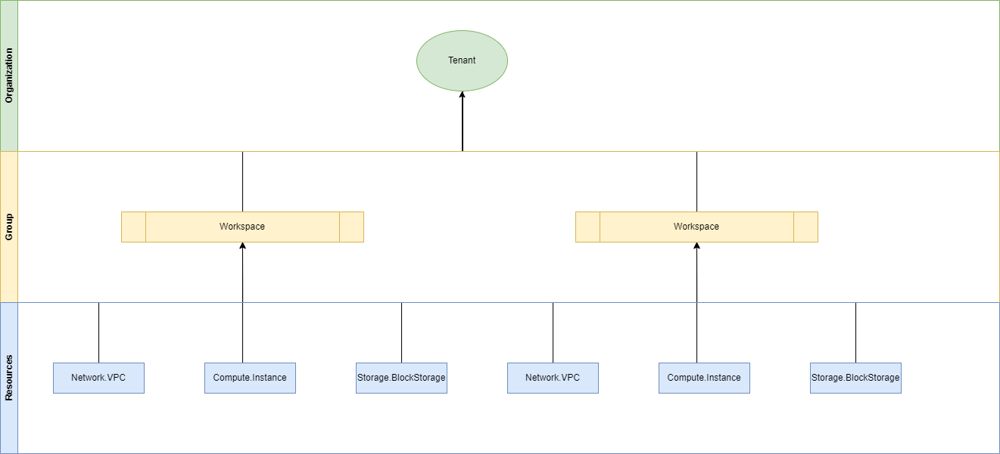

# **Resource Design**

# Table of Contents
- [Introduction](#introduction)
- [Architecture](#resource-model)
  - [Control Plane](#architecture)
  - [Data Plane](#resource-model)
- [Resource Model](#resource-model)
  - [Resource Definition](#resource-definition)
    - [Metadata](#metadata)
    - [Properties](#properties)
    - [Status](#status)
  - [Resource Lifecycle](#resource-lifecycle)
- [Resource Organization](#resource-organization)
- [Resource Authorization](#resource-authorization)

## **Introduction**
The aim of this document is to define guidelines to design resource model for the eurocloud APIs

## **Architecture**

Cloud Requests can be divided in two categories:
  - **Control plane** 
    - Those APIs are used to create and manage cloud resources in a specific tenant
    - All requests are sent to a Cloud Resource Manager;
    - Control plane APIs manage **resources**.
    - Control plane returns configurations(e.g., metadata, resource properties, states).
    - It's easier to define Control plane resources to follow a more standardized Resource schema
    - These APIs return resource management data, such as metadata, configuration details, status.
  - **Data plane**
    - Requests for Data Plane operations are sent to an endpoint that's specific to your instance.
    - The purpose is to interact with the actual data or service provided by a Cloud Resource (e.g., reading/writing to a object storage, querying a database, etc.).
    - Data plane APIs manage **data**.
    - Data plane returns actual data (e.g., files, query results, or data manipulation responses)
    - Data plane schemas vary widely based on the type of data and the service object (e.g., NFS, SQL, Key/Value, Kubernetes API, Vaults, etc.).
    - These APIs return and operate on actual data rather than metadata or configuration
- Data plane APIs are differing in capabilities by versions, so instead of APIs the versions and enabled capabilities need to be standardized in form of a minimal set. E.g. PostgreSQL would be the same in all clouds, so one can define the available versions and extensions for that versions. Every cloud provider is free to add more.

### **Control Plane**

Control Plan APIs have all the following template:

```bash
`https://{service}.{domain}/{scope}/providers/{resourceProviderNamespace}/{resourceType}[/{resourceName}][/{action}]?api-version={api-version}[&{queryStringParameters}]`
```


| Parameter | Description |
|---------- | ----------- |
| service   | Name of the cloud service, ”api” in our case |
| domain    | Cloud Service Provider domain name (ad es. aruba.it, arubacloud.com, etc.) |
| scope    | A hierarchical set of key-value pairs that identify the origin of the resource. <br/> Scopes answer questions like: “What cloud account contains this resource?<br/>"Which department or organizational unit this resource belongs to ?"<br/>"What logical group this resource belongs to ?"<br/>|
| resourceProviderNamespace    | The namespace and type of a resource. These are defined together because resource types are usually two segments - a vendor namespace and a type name. For example Aruba.Compute. Each Resource is managed by a Resource Provider. The implementation of Resource Provider is CSP specific. A single Resource Provider can manage multiple resource types|
| resourceType    | The type of Resource|
| resourceName    | The name of the Resource. Sub-resources are allowed. They follow the parent resource in the URL path|


## **Resource Model**

- Every object managed by the APIs is a Resource. It can be created, updated, read, listed and disposed of.
- Generally, each Resource has a provisioning state, managed by a specific Resource Provider that owns one or more Resources, grouped by shared characteristics.


### **Resource Definition**

| Section | Description |
|-------------|---------|
|metadata| a set of standard fields included in every SECA Resource Object, which provides essential information for identifying, categorizing, and managing that resource within the CSP|
|properties| specific settings that define the desired state of a SECA Resource Object. These properties vary depending on the type of resource and determine how the resource behaves in the CSP.|
|status| reflects the current observed state of the object within the CSP. This field is typically managed and updated automatically by the CSP system and provides insight into the resource's actual state versus its desired configuration|

#### **Metadata**

Additional data that convey some system information related to the control loop mechanisms that regulate the system’s dynamic equilibrium
Some of their functions are:
- **Semantic Interoperability** - which allows searching across different disciplinary fields through a series of equivalences between descriptors;
- **Availability** -  meta information such as the region and availability zone where a resource is hosted


#### **Properties**

The record of intent that describes the changes to be applied to a resource; in other words, the desired state of the resource.
- This section is highly customizable, allowing users to specify attributes which the CSP s uses to tailor the resource's setup and allocation to meet operational needs. 
- By configuring these properties, the CSP ensures that the cloud resource aligns with both user requirements and cloud-specific features, automating resource management and scalability across complex, multi-cloud or hybrid cloud environments.


#### **Status**
The purpose of this section is to provide insights into the current state of a resource. Customers,by examining this status information, can assess resource health, troubleshoot issues, and confirm successful deployments or configurations.

What do we include in the status object is below described:

- **conditions** 
  - **type** - the condition type (e.g Ready, Available, Progressing)
  - **status** - wheter the condition is met (True, False, or Unknown)
  - **lastTransitionTime** - When the condition last changed
  - **reason** - Details about the current condition status, helpful for debugging or understanding issues.
  - **message** - Human-readable message indicating details about the last status transition
- **phase** - indicates the resource lifecycle phase, like Pending, Succeeded, Failed or Unknown.
- **properties**  - Resource-Specific Status Fields; each cloud resource type has unique status fields tailored to its function
  - **hostIp** - IP addresses assigned to the Virtual Machine (E.g Compute Instance)
  - **availableReplicas** - number of nodes currently available and running (E.g KaaS Node Pool)
  - **updatedReplicas** - number of nodes with the latest resource version (E.g KaaS Node Pool)
  - **replicas** - desired node replicas as per the spec (E.g KaaS Node Pool)
  - **unavailableReplicas** - number of node replicas not available due to issues (E.g KaaS Node Pool)


### **Resource Lifecycle**

| Operation | HTTP Verb | Description |
|-------------|---------|-------------|
| Read   |  GET   |Retrieve the representation of a specific resource|
| Create |  PUT   |creates a resource|
| Update |  PUT |updates a resource|
| Delete |  DELETE|Deletes a specific resource|
| List   |  GET   |Retrieve the representations of a set of resources. The output set can be determined based on a filter passed on input|
| Action |  POST  |Control Plan APIs can be extended by Actions (for example PowerOff and Restart for Virtual Machines)|

## **Resource Organization**

A cloud organization model is a framework that defines how an organization structures, manages, and governs its resources, users, and permissions within a cloud environment



## **Resource Authorization**