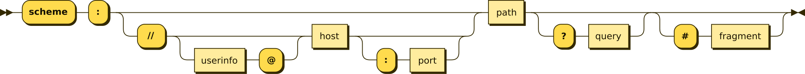

# **Api Conventions**

# Table of Contents
- [Introduction](#introduction)
- [API Security](#api-security)
- [API Model](#api-model)
  - [Entity](#entity)
  - [Relationship](#relationship)  
  - [URI Naming Convention](#uri-naming-convention)
- [Operations and HTTP Methods](#operations-and-http-methods)
- [HTTP Semantics](#http-semantics)
  - [Media Type](#media-type)
    - [JSON](#json)
      - [Casing](#casing)
      - [Naming](#naming)
      - [Type Conversion](#type-conversion)
  - [GET Method](#get-method)
  - [HEAD Method](#head-method)
  - [PUT Method](#put-method)
  - [POST Method](#post-method)
  - [PATCH Method](#patch-method)
  - [DELETE Method](#delete-method)
  - [Conditional Requests](#conditional-requests)
  - [Status Code](#status-code)
    - [Group By Category](#group-by-category)
    - [Status Detail](#status-detail)
    - [Problem Details - Response Body for 4xx and 5xx Categories](#problemdetails---response-body-for-4xx-and-5xx-categories)
- [Filtering, Sorting and Pagination](#filtering-sorting-and-pagination)     
  - [RPC Requests](#rpc-requests)
  - [OData & GraphQL](#odata-e-graphql)
- [HATEOS](#hateos)
  - [HAL](#hal)
- [Versioning](#versioning)
  - [Semantic Versioning]
  - [Breaking Change Definition](#breaking-change-definition)
  - [Examples of additive modifications that are not necessarily breaking](#examples-of-additive-modifications-that-are-not-necessarily-breaking)
  - [Universal examples of breaking changes](#universal-examples-of-breaking-changes)
  - [Evolutionary and Support](#evolutionary-and-support)
- [Asynchronous Operations](#asynchronous-operations)
  - [Asynchronous Request-Reply Pattern](#asynchronous-request-reply-pattern)
  - [Solution](#solution)
  - [Considerations and Issues](#considerations-and-issues)
  - [When should you use this model?](#when-should-you-use-this-model)


## Introduction

Most modern web applications expose APIs that can be used by clients to interact with the application

A properly designed Web API should support:

**Platform independence**
- Any client should be able to call the API regardless of how it is implemented internally. To achieve this, it is necessary to use:

**Standard protocols**
- A mechanism that allows the client and the Web service to agree on the format of the data to be exchanged.

**Service evolution**
- The web API must have the ability to evolve and add functionalities independently from client applications.

- With the evolution of the API:
  - Client applications should continue to function without modifications.
  - All functionalities should be discoverable in order to be fully utilized by client applications.

The following URI definition will help us identify the entry points for different modeling and versioning strategies.

```
URI = scheme:[//authority]path[?query][#fragment]
authority = [userinfo@]
host[:port]
```



## API Security

In the context of security by design, these topics are intentionally mentioned before further details on API modeling.

- **Authentication** and **authorization** are two distinct concepts. The first deals with subjects, while the second concerns the objects of the requests made.

  Often abbreviated as **authn** and **authz**, the authentication process ensures that the presented credentials are correct, while the authorization process checks that the permissions granted to the requesting subject are sufficient for the operation they want to perform on a specific resource.

APIs must support authentication using the OAuth 2.0 protocol family, implementing at least the following flows:

- **Authorization Code Flow** for integrations with web frontends
- **Client Credentials Flow** for server-to-server integrations

In any case, the API implementation should not prevent support for other flows defined by the OAuth 2.0 family.

APIs must also apply appropriate authorization schemes for API calls based on the roles contained in the claims, mapping granularly which operations are allowed for each role, to:

- Prevent unauthorized calls based on the user’s roles
- Limit and/or filter the data available based on the user’s roles
- Provide the ability to enable or disable various flows specifically for each API method (for example, a method is available only for the Client Credentials flow)


## API Model

### Entity

In a cloud provider domain, for example, some primary entities could be virtual machines and networks. 

Such an example, a disk can be created by sending an HTTP PUT request containing the resource information. 
- The HTTP response indicates whether the request was successfully submitted. 
- Whenever possible, resource URIs should be based on nouns (i.e., the resource) rather than verbs (i.e., the operations performed on the resources).

  ```
  // Correct
  https://mycloud.eu/${scope}/disks
 
  // Not Correct
  https://mycloud.eu/${scope}/create-disks
  ```

  
- Sending an HTTP GET request to the collection's URI retrieves a list of the elements within it; each element in the collection also has its own unique URI. 
- An HTTP GET request to an element's URI returns the details of that element.

### Relationship

It is also important to consider the relationships between different types of resources and how those associations could be exposed. 
- For example, `/virtualMachines/my-vm/disks` could represent all the disks for the virtual machine my-vm. 
- It is also possible to go in the opposite direction and represent the association from a disk to a virtualMachine with a URI like `/disks/disk-test/virtualMachines`. 

However, if this model is adopted excessively, its implementation could become complex. It is preferable to provide discoverable links to associated resources in the body of the HTTP response. This mechanism is described in more detail in the **HATEOAS** section to enable navigation to related resources.

### URI Naming Convention

1. It is necessary to adopt a consistent naming convention for URIs. In general, it is useful to use plural nouns for URIs referring to collections. 
   - when the resource being modeled has a name consisting of multiple words, it is necessary to use **camelCase**
   - Resource collections should be all **plurals**
 
   For example:
    - `/virtualMachines/`
    - `/securityGroups/`
    - `/networkInterfaces/`

 2. It is advisable to organize the URIs for collections and elements in a hierarchy. For example, if `/networks` is the path for the network collection, then `/networks/my-net` will be the path for the network whose name is my-net. This approach helps to keep the web API intuitive. Many web API frameworks can also route requests based on URI paths with parameters, so it is possible to define a route for the path `/networks/{name}`.


 3. In more complex systems, there may be a temptation to provide URIs that allow a client to traverse multiple levels of relationships, such as `/virtualMachines/my-vm/disks/disk-00/snapshots`. However, this level of complexity can be difficult to maintain and would likely become overly rigid if the relationships between resources change in the future. 
    - It is better to try to keep URIs relatively simple. When an entity contains a reference to a resource, it should be possible to use that reference to find the elements related to that resource. The previous query can be replaced with the URI `/virtualMachines/my-vm/disks` to find all disks for virtual machine my-vm, and then `/disks/my-disk/snapshots` to find the snapshots for that disk.

4. Another factor to consider is that all web requests impose a load on the server. The greater the number of requests, the greater the load. Therefore, try to avoid "fragmented" APIs that expose a large number of small resources. Such an API may require a client application to send multiple requests to retrieve all the necessary data. It may be more appropriate to denormalize the data and combine related information into larger resources that can be retrieved with a single request. However, this approach must be balanced against the overhead of retrieving unnecessary data for the client. Retrieving large objects can increase request latency and add bandwidth costs.

5. Avoid introducing dependencies between the resource APIs and the underlying data sources. For example, if the data is persisted in a relational database, it is not necessary for the resource API to expose each table as a collection of resources, as this could likely be a design flaw. Instead, consider the web API as an abstraction over the database. If necessary, introduce a mapping layer between the database and the web API. This way, client applications are isolated from changes to the underlying database schema.

6. Finally, it may not always be possible to map every operation implemented by a web API to a specific resource. Such scenarios, which do not correspond to a resource, can be handled through HTTP requests that invoke a function and return the results as an HTTP response. A web API that implements simple arithmetic operations like addition and subtraction, for example, might provide URIs that expose these operations as pseudo-resources and use the query string to specify the necessary parameters. For example, a GET request to the URI `/add?op1=99&op2=1` returns a response with a body containing the value 100. However, the use of such URI formats is extremely rare and should be limited as much as possible.

## Operations and HTTP Methods

The HTTP protocol defines a series of methods that assign semantic meaning to a request. The HTTP methods used by most RESTful Web APIs are:

- **GET** - Retrieves a representation of the resource at the specified URI. The response body contains the details of the requested resource.
- **POST** - Can be used to initiate operations that do not actually create resources such as actions.
- **PUT** - Creates or replaces the resource at the specified URI. The request body specifies the resource to be created or updated.
- **PATCH** - Performs a partial update of a resource. The request body specifies the set of changes to apply to the resource.
- **DELETE** - Removes the resource at the specified URI.

The effect of a specific request varies depending on the type of resource (collection or a single item). The table below summarizes common conventions adopted by most RESTful implementations using the example of an e-commerce system. Not all of these requests may be implemented—it depends on the specific scenario.

| HTTP Method | Collection URI (e.g: `https://api.cloud.eu/collection/`) | Element URI (e.g. `https://api.cloud.eu/collection/item1`)          |
|-------------|----------------------------|---------------------------------------|
| PUT         | Create - The Collection Resource is created if it does not exist. | The Element Resource and any nested Element Resources are created or replaced with the representations contained in the body of the request   |
| PATCH       | Update - All representations of the Element Resources contained within the Collection Resource are updated with the instructions in the request. | Update - The Element Resource and any nested Element Resources are updated with the instructions contained in the body of the request. |
| DELETE       | Removes all representations of the Element Resources from this Collection Resource.            | Removes the Element Resource and any nested Element Resources.  |
| GET         | The URIs of the collection members are returned in the body of the response | Retrieves the representation of the Element Resource, which will be contained in the body of the response. |
| POST      | Not Applicable | Performs an action on the Element Resource   |

| Resource | PUT | PATCH | DELETE | GET | POST |
|-------------|-------------|-------------|-------------|-------------|-------------|
| /virtualMachines |  405 Method Not Allowed | Perform a bulk update of customers using the instructions contained in the request.  | 405 Method Not Allowed | Retrieve all virtual machines | 405 Method Not Allowed |
| /virtualMachines/my-vm | Create a new Virtual Machine **my-vm** if does not exists yet | Perform the resource update using the instructions contained in the request  | Remove the virtual machine **my-vm** | Retrieve details of **my-vm** virtual machine | 405 Method Not Allowed |
| /virtualMachines/my-vm/powerOff | 405 Method Not Allowed | 405 Method Not Allowed  | 405 Method Not Allowed | 405 Method Not Allowed | Stop the virtual machine **my-vm** if makes sense  |
| /virtualMachines/my-vm/networkInterfaces | 405 Method Not Allowed | 405 Method Not Allowed | 405 Method Not Allowed | Retrieve all network interfaces for the virtual machine **my-vm** | 405 Method Not Allowed |
| /virtualMachines/my-vm/networkInterfaces/my-nic | Create a new **my-nic** network Interface if does not exist yet | Perform the network interface update, for the vm **my-vm**, using the instructions contained in the request | Remove the network interface **my-nic** of the **my-vm** virtual machine | Retrieve the **my-nic** network interface detail attached to the virtual machine **my-vm** | 405 Method Not Allowed |

**Notes**

- A **PUT** request creates a resource or updates an existing one. The client specifies the URI for the resource. The request body contains a complete representation of the resource. If a resource with that URI already exists, it is replaced. Otherwise, a new resource is created, if this operation is supported by the server. PUT requests are more frequently applied to individual items, like a specific virtual machine, rather than to collection resources. A server might support only updates but not creation through PUT. Whether or not creation via PUT is supported depends on whether the client can assign a meaningful and unique URI to a resource that doesn't yet exist. If the client cannot, POST should be used to create resources, and PUT or PATCH for updates.
- A **PATCH** request performs a partial update of an existing resource. The client specifies the resource URI, and the request body specifies a set of changes to apply to the resource. PATCH can be more efficient than PUT because the client only sends the changes, not the entire resource representation. Technically, PATCH can also create a new resource by specifying a set of updates for a "null" resource, if the server supports this operation.
- **PUT** requests must be idempotent. If a client sends the same PUT request multiple times, the results must always be the same, meaning the same resource will be updated with the same values. In contrast, POST and PATCH requests are not guaranteed to be idempotent.

## HTTP Semantics
This section describes some typical considerations for designing an API that complies with the HTTP specification. However, it does not cover every possible detail or scenario. In case of doubt, consult the HTTP specifications.

### Media Type

- As mentioned earlier, clients and servers exchange representations of resources. In a POST request, for example, the request body contains a representation of the resource to be created. In a GET request, the response body contains a representation of the retrieved resource.

- In the HTTP protocol, formats are specified using Media Types, also known as MIME types. For non-binary data, most Web APIs support JSON (i.e., the media type application/json) and possibly XML (i.e., the media type application/xml).

- The Content-Type header specifies the format of the representation. Below is an example of a POST request containing JSON data:

```javascript
PUT https://api.cloud.eu/${scope}/virtualmachines/my-vm HTTP/1.1
Content-Type: application/json; charset=utf-8
Content-Length: 47

{"Flavor":"K0063","OS":"Ubuntu24.01"}
```

If the server does not support the media type, it must return the HTTP status code 415 (Unsupported Media Type).

A client request can include an Accept header containing a list of media types that the client will accept in the server’s response. For example:

```javascript
GET https://api.cloud.eu/${scope}/virtualMachines/my-vm HTTP/1.1
Accept: application/json
```

If the server cannot provide a media type matching those listed, it must return the HTTP status code 406 (Not Acceptable).

#### JSON

##### Casing
- The casing adopted must be camelCase.

##### Naming
- The identifier field of an object will be expressed in the following form: id.

##### Type Conversion
- For those media types where there is no 1:1 conversion between the server-side data type and the one transmitted to clients, we adopt the following convention:

| Native Type | JSON Type | Format Spec | Note |
|-------------|-------------|-------------|-------------|
| null| null | | |
| boolean | bool | | |
| byte, sbyte, int32, int64, uint32, uint64, float, double | number culture-invariant string | All numbers up to a maximum precision of 64 bits ([IEEE 754](https://en.wikipedia.org/wiki/IEEE_754), [binary64](https://en.wikipedia.org/wiki/Double-precision_floating-point_format)). | { "add": 123.5 }<br/>{ "add": 5 }<br/>{ "add": "136573525573.86576576" }| 
| decimal/arbitrary precision numbers | culture-invariant string |(?<sign>[+\|-])?(?<number>\d+)(?<digits>(?<separator>.)\d+)? | { "add": "136573525573.86576576" }|  
| string | string | [UTF-8](https://en.wikipedia.org/wiki/UTF-8) | If necessary, [UTF-16](https://en.wikipedia.org/wiki/UTF-16) surrogate pairs should be used for escape sequences of glyphs outside the [Basic Multilingual Plane](https://en.wikipedia.org/wiki/Plane_(Unicode)#Basic_Multilingual_Plane) (U+10000 to U+10FFFF)| 
| guid/uuid/ulid | string | (?<uuid>[0123456789abcdef]{32})| Example: a2b4c746c71745a8ad8f3cf7a1cede9b |
| blob | string | [base64](https://en.wikipedia.org/wiki/Base64) | |
| date, time, datetime, duration, time intervals | string | [RFC339](https://datatracker.ietf.org/doc/html/rfc3339) ([ISO 8601](https://en.wikipedia.org/wiki/ISO_8601) profile) | Time: 09:30,<br/> UtcTime: 09:30Z,<br/> DateTime: 2020-02-26T16:23:11.1196470+01:00,<br/> UtcDateTime: 2020-02-26T15:23:11.1280371Z,<br/> Duration: P3Y6M4DT12H30M5S,<br/> StartAndEndTimeInterval: 2007-03-01T13:00:00Z/2008-05-11T15:30:00Z,<br/> StartAndDurationTimeInterval: 2007-03-01T13:00:00Z/P1Y2M10DT2H30M,<br/> DurationAndEndTimeInterval: P1Y2M10DT2H30M/2008-05-11T15:30:00Z,<br/> DurationOnlyTimeInterval: P1Y2M10DT2H30M``` |
| enum | string | conversion to string with camelCase |  |

#### GET Method
- A successful GET method typically returns the HTTP status code 200 (OK). If the resource is not found, the method should return 404 (Not Found)

#### HEAD Method
- The **HEAD** method requires a response identical to the GET method (using the same semantics as GET), but without returning the response body to the client. It can be used to check the existence of a resource.

#### PUT Method
- If a **PUT** method creates a new resource, it must return the HTTP status code 201 (Created). The URI of the new resource is included in the Location header of the response. The body will contain a representation of the resource
- If the method updates an existing resource, it will return 200 (OK) or 204 (No Content). In some cases, it may not be possible to update an existing resource. In such circumstances, consider returning the HTTP status code 409 (Conflict).
- Consider implementing bulk HTTP PUT operations that can perform batch updates of multiple resources within a collection. The PUT request should specify the URI of the collection, and the request body should specify the details of the resources to be modified. This approach helps reduce fragmentation and improves performance.

#### POST Method
- When it performs a processing task the method may return the HTTP status code 200 and include the result of the operation in the response body. 
- If there are no results, the method can return the HTTP status code 204 (No Content) without a response body, or HTTP 202 (Accepted) if an asynchronous process has been initiated.  
  - In this case, the Location header will contain a reference to a resource that can provide the status of the request's progress.

If the client submits invalid data in the request, the server must return the HTTP status code 400 (Bad Request). The response body should contain additional information about the error or a link to a URI providing more details

#### PATCH Method
- With a PATCH request, the client sends a set of updates to an existing resource in the form of a patch document. The server processes the patch document to apply the updates, which will not describe the entire resource but only a set of changes to be applied. The specification for the PATCH method ([RFC 5789](https://datatracker.ietf.org/doc/html/rfc5789)) does not define a particular format for patch documents. The format must be inferred from the media type in the request.
- The most common data format for Web APIs is likely JSON. There are two main JSON-based patch formats, known as "JSON Merge Patch" and "JSON Patch".
- The **Merge Patch** format is the simpler one: the document follows the same structure as the original JSON resource but includes only the subset of fields to be modified or added.
- A field can be deleted by specifying null as its value.

For example, let's assume the original resource has the following JSON representation:
```json
  {
    ...
    "properties": {
      "flavor": "KA0006R",
      "os": "Ubuntu22.04LTS",
      "init": "script.sh"
    }
    ...
  }    
  ```
Below is a possible Merge Patch document for that resource:
```json
  {
    "properties": {
      "os": "Ubuntu24.04LTS",
      "init": null
    }
  }    
  ```
In this way, the API is instructed to update the os property, delete the init property, while flavor remains unchanged. For detailed information on Merge Patch, refer to the specification [RFC 7396](https://datatracker.ietf.org/doc/html/rfc7396).

- We can adopt the GET → PATCH model with If- headers to ensure that we send updated values, inclusive of any changes.*

Strategic Merge is useful to avoid the roundtrip of the initial GET.

Below are some typical error conditions that can occur during the processing of a PATCH request, along with the appropriate HTTP status code.

| Error Condition | HTTP Status Code |
|-----------------| -----------------|
|The format of the patch document is not supported.|	415 (Unsupported Media Type) |
|The format of the patch document is not valid.|400 (Bad Request)|
|The patch document is valid but changes could not be applied with the current state|409 (Conflict)|
|The patch document is valid but changes could not be applied due to Match Headers failed precondition |409 (Conflict)|

#### DELETE Method
- If the deletion operation is successful, the API will respond with the HTTP status code 204, indicating that the process was handled correctly and that the response body will not contain further information. If the resource does not exist, the API may return the HTTP status code 404 (Not Found).

#### Conditional Requests

See the dedicated [reference](https://datatracker.ietf.org/doc/html/rfc7232) for further details. In short, it's possible to define precondition needed to consider a request valid.

- These preconditions are usually expressed through specific headers and are used in scenarios where multiple actors are simultaneously modifying a resource. Preconditions (based on an ETag, for example) help prevent the lost update phenomenon.

#### Status Code

##### Group By Category

| Category | Description |
|----------| ------------|
|1xx Informational| Not to be used except in experimental conditions, as they are not standardized |
|2xx Success| This class of status codes indicates that the action requested by the client has been received, understood, and accepted. |
|3xx Redirection| This class of status codes indicates that the client must take further action to complete the request. Many of these status codes are used for [URL redirection](https://en.wikipedia.org/wiki/URL_redirection). <br/> A user agent may perform the action without user intervention only if the method to be used is GET or HEAD. A user agent may automatically redirect a request. A user agent should detect and prevent any cyclic redirects. |
|4xx Client Error| This class of status codes is to be used in cases where the client is the cause of the error. Except for HEAD requests, the server should include an entity/representation containing an explanation of the error and whether it is transient or permanent. These status codes are applicable to all methods. User agents should display the information to users. |
|5xx Server Error| The server was unable to fulfill the request.<br/>Status codes that begin with the digit "5" indicate cases where the server encountered an error or was otherwise unable to process the request. Except for HEAD requests, the server should include an entity/representation containing an explanation of the error and whether it is transient or permanent. These status codes are applicable to all methods. User agents should display the information to users. |

##### Status Detail

[Reference](https://httpstatuses.com/)

| Code | Description |
|----------| ------------|
|200 OK | Indicates that the client's request has been successfully processed and that there is no more appropriate status code in the 2xx category.<br/><br/> Unlike status code 204, a response with a 200 code should include a body. The information returned depends on the method used in the request, for example: <br/> **GET** - the requested entity. <br/> **HEAD** - the HTTP headers of the requested entity (e.g., ETag, etc.).<br/> **POST** - an entity that describes or contains the result of the request. |
|201 Created| Typically used when a resource has been created within a Collection Resource, but it would also be appropriate in cases where the resource is created as a result of a controller's action.<br/> The newly created resource can be referenced by one or more URIs returned in the response, with the most specific URI for the resource contained in the Location header.<br/> The server must have created the resource before returning a 201 status code. If the action cannot be completed immediately, the server must respond with a 202 Accepted status code.<br/>|
|202 Accepted| Typically used for actions that take time to complete. It indicates that the request has been accepted for processing, but the processing is not yet complete. The outcome of the request is therefore not yet known and could be prevented if attempted again before the previous process has finished.<br/> The purpose is to allow the server to accept a request for another process (normally asynchronous/long-running/scheduled) without forcing the user agent to keep a connection open until the procedure is completed.<br/>The entity returned with the response should include an indication of the current status of the request and a pointer to a resource that shows the progress of the task.<br/>The Location header can be used instead of a body.<br/>The response might also include, in its headers, an estimated time for when the asynchronous process will be completed.  |
|204 No Content| The server has successfully processed the request, and there is no body in the response. |
|302 Found| The target resource resides temporarily under a different URI. Since the redirection might be altered on occasion, the client ought to continue to use the effective request URI for future requests. |
|303 See Other| The server is redirecting the user agent to a different resource, as indicated by a URI in the Location header field, which is intended to provide an indirect response to the original request. |
|400 Bad Request| 400 is the generic client-side error status, used when no other code in the 4xx error category is more appropriate. Request errors (body or parameters) can fall into this category.<br/>The client should not repeat the request without making the appropriate changes, which may be indicated in the response of the previous invalid request. |
|401 Unauthorized| A 401 error indicates that the client attempted to operate on a resource without providing the necessary credentials. The response must include the WWW-Authenticate header containing a challenge applicable to the requested resource.<br/> The client may repeat the request with the appropriate Authorization header. If the initial request already included the header, the 401 response indicates that authorization was denied for those credentials. |
|403 Forbidden| A 403 code indicates that the request is formally valid, even from an authentication perspective, but the server refuses to process it because the user lacks the necessary permissions, or the resource's state does not allow this particular operation. A 403 response is not a case of incorrect credentials; that would be the 401 Unauthorized code.<br/> Re-authenticating would not resolve the issue, and the request should not be repeated, as the problem lies with permissions, not credentials. |
|404 Not Found | The 404 status indicates that the requested resource could not be found by the client via the URI, but it may become available in the future, so further requests from the client are allowed.<br/>No indication is given as to whether the condition is permanent or temporary.|
|409 Conflict | The request could not be completed due to a conflict with the current state of the target resource. This code is used in situations where the user might be able to resolve the conflict and resubmit the request.|
|410 Gone | The 410 Gone status should be used, via some configurable internal mechanism, when an old resource is no longer available and no forwarding information to another entity exists. This status is also used by servers to avoid revealing the exact reason the request was denied, or if other status codes are not applicable.|
|412 Precondition Failed | The 412 code indicates that the preconditions expressed by the client in the request headers could not be met by the server (e.g[If-Match](https://developer.mozilla.org/en-US/docs/Web/HTTP/Headers/If-Match)|
|415 Unsupported Media Type| The origin server is refusing to service the request because the payload is in a format not supported by this method on the target resource.|
|5xx Server Error| 500 is a generic error code. Most web application frameworks return this error when an exception occurs in one of the components handling the requests.<br/>A 500 error is not caused by the client, so it is reasonable for a client to retry the operation to obtain a valid response.|

##### ProblemDetails - Response Body for 4xx and 5xx Categories
- It is necessary to adopt a shared data model for error responses.

This model is outlined in [RFC 7807 - Problem Details](https://tools.ietf.org/html/rfc7807). Libraries and frameworks for various server-side technologies should provide functionalities to easily adopt this model.

A ProblemDetails object, as specified, can contain the following elements:
|type (string)| A [URI reference](https://tools.ietf.org/html/rfc3986) that identifies the type of problem. When dereferenced, it should provide human-readable documentation (e.g., using [HTML](https://html.spec.whatwg.org/multipage/)). When this value is not present, it is considered populated with "about:blank"|
|title (string)|A brief, human-readable description of the problem. It should not change between occurrences of the same problem, except for localization needs (e.g., using proactive content negotiation; see [RFC7231](https://tools.ietf.org/html/rfc7231#section-3.4), Section 3.4). |
|status (number)|The HTTP status code ([RFC7231 Section 6](https://tools.ietf.org/html/rfc7231#section-6), ) generated by the origin server for this occurrence of the problem. |
|detail (string)|A human-readable explanation that describes this specific occurrence of the problem.|
|instance (string)|A URI reference that uniquely identifies this specific occurrence of the problem.<br/>It is useful for tracking the instance of the problem within a structured log.<br/>It may be dereferenced to obtain more information, but this is not mandatory.|

It may also contain a series of elements that provide additional information for the particular type of problem encountered. For example:

```json
HTTP/1.1 403 Forbidden
Content-Type: application/problem+json
Content-Language: en
 
{
    "type": "https://example.com/probs/out-of-credit",
    "title": "You do not have enough credit.",
    "detail": "Your current balance is 30, but that costs 50.",
    "instance": "/account/12345/msgs/abc",
    "balance": 30,
    "accounts": ["/account/12345",
                 "/account/67890"]
}
```

In this case, the fields balance and account are specific to the type of error https://example.com/probs/out-of-credit.

Or, in the case of validation problems with a request:

```json
HTTP/1.1 400 Bad Request
Content-Type: application/problem+json
Content-Language: en
 
{
   "type": "https://example.net/validation-error",
   "title": "Your request parameters didn't validate.",
   "errors": {
       "age": [ "must be a positive integer" ],
       "color": [ "must be 'green', 'red' or 'blue'" ]
   }]
}
```

As in the example, the errors contain the validation issues encountered during processing.

The **errors** object is an associative array where the key is the name of the request property, and the value is a list of related error messages.

If it is not possible to identify a single property that caused the error, it is acceptable for the key to be an empty string, for example:

```json
HTTP/1.1 400 Bad Request
Content-Type: application/problem+json
Content-Language: en
 
{
   "type": "https://example.net/validation-error",
   "title": "Your request parameters didn't validate.",
   "errors": {
       "": [ "this request contains too many errors to list" ]
   }]
}
```

## Filtering, Sorting and Pagination

- By exposing a collection of resources through a single URI, applications might retrieve large amounts of data when only a subset of information is needed. For example, suppose a client application needs to find all orders with a price above a specific value. It could retrieve all orders from the URI /orders and then filter those orders client-side. This process is clearly inefficient as it wastes bandwidth and processing time on the server hosting the web API.
- Instead, the API can allow passing a filter in the query string of the URI, for example, /orders?minCost=n. The web API would then be responsible for parsing and handling the minCost parameter in the query string and returning the filtered results server-side.
- GET requests on collection resources might return a large number of items. It is advisable to design a web API to limit the amount of data returned in each request. Consider supporting query strings that specify the maximum number of items to retrieve and an initial offset in the collection, for example:

```json
HTTP 
/orders?limit=25&offset=50
```

- Consider also the possibility of imposing a maximum limit on the number of returned items to prevent Denial of Service attacks. To assist client applications, GET requests that return paginated data should also include metadata indicating the total number of available resources in the collection.

- The response to a paginated GET request may also include links:

  - first
  - last
  - next
  - prev

```json
{
    "self": "https://dogtracker.com/dogs?limit=25&offset=0",
    "kind": "Page",
    "pageOf": "https://dogtracker.com/dogs",
    "next": "https://dogtracker.com/dogs?limit=25&offset=25",
    "values": [
        {
            "self": "https://dogtracker.com/dogs/12344",
            "kind": "Dog",
            "name": "Fido",
            "furColor": "white"
        },
        {
            "self": "https://dogtracker.com/dogs/12345",
            "kind": "Dog",
            "name": "Rover",
            "furColor": "brown"
        },
        ... (23 more)
    ]
}
```

It is possible to use a similar strategy to sort the data while retrieving it, by specifying a sort parameter that accepts a field name as a value, for example /orders?sort=productId. However, this approach can have a negative effect on caching because query string parameters are part of the resource identifier, which is used by many caching implementations as a key to store data.

To indicate ascending or descending order, a parameter order (or sortOrder, in case of conflicts with existing naming conventions) can be included with accepted values asc(ending) and desc(ending).

This approach can be extended to limit the fields returned for each item, if each contains a large amount of data. For example, a query string parameter can be used to accept a comma-delimited list of fields, such as /orders?fields=productId,quantity.

Consider assigning meaningful default values to all optional query string parameters. For example, set the limit parameter to 10 and the offset parameter to 0 when implementing pagination, set the sort parameter to the resource’s primary key when implementing sorting, and set the fields parameter to include all resource fields when supporting projections.

You can find additional ways of managing pagination, filtering, and sorting at the following links:

- https://nordicapis.com/4-examples-of-restful-api-pagination-in-production/
- https://specs.openstack.org/openstack/api-wg/guidelines/pagination_filter_sort.html

#### RPC Requests

Sometimes it can be convenient to name an API with a verb rather than a noun (e.g., Compute, Start, Stop, Create, Convert, etc.). Even in these cases, it is quite likely that an RPC operation on an action can be translated as a REST command on another "surrogate" resource. 

#### OData e GraphQL

[OData](https://www.odata.org/odata-services/) and [GraphQL](https://graphql.org/learn/) are two technologies that, when properly configured, can address specific use cases. They diverge from what is prescribed by REST, as they do not fully or partially adhere to the prescribed constraints.

## HATEOS

One of the main motivations behind the REST approach is that it should be possible to navigate the entire set of resources without prior knowledge of the URI schema. Each HTTP GET request should return the necessary information to find related resources directly through hyperlinks included in the response, and at the same time, it should also contain information that describes the available operations for each of these resources. This principle is known as HATEOAS, or Hypertext as the Engine of Application State. The system is essentially a finite state machine, and the response to each request contains the information needed to transition from one state to another. No further information should be required

To manage the relationship between an virtual machine and a network interface, for example, the representation of an order could include links that identify the operations available for the customer of the order. Below is a possible representation:

```json
{
  "flavor": "KA0006R",
  "os": "Ubuntu22.04LTS",
  "init": "script.sh",  
  "links": [
    {
      "rel": "nic",
      "href": "https://api.cloud.eu/${scope}/networkInterfaces/my-nic-1",
      "action": "GET",
      "types": ["text/xml","application/json"]
    },
    {
        "rel": "nic",
        "href": "https://api.cloud.eu/${scope}/networkInterfaces/my-nic-1",
        "action": "PUT",
        "types": ["application/x-www-form-urlencoded"]
    },    
    {
        "rel": "nic",
        "href": "https://api.cloud.eu/${scope}/networkInterfaces/my-nic-1",
        "action": "DLETE",
        "types": ["application/x-www-form-urlencoded"]
    },
    {
      "rel": "self",
      "href": "https://api.cloud.eu/${scope}/virtualMachines/my-vm",
      "action": "GET",
      "types": ["text/xml","application/json"]
    },
    {
      "rel": "self",
      "href": "https://api.cloud.eu/${scope}/virtualMachines/my-vm",
      "action": "PUT",
      "types": ["application/x-www-form-urlencoded"]
    },  
    {
      "rel": "self",
      "href": "https://api.cloud.eu/${scope}/virtualMachines/my-vm",
      "action": "DELETE",
      "types": []
    }]
}
```

In this example, the links array contains a set of links, each representing an operation on a related entity. The data for each link includes the relation ("customer"), the URI (https://api.cloud.eu/${scope}/networkInterfaces/my-nic-1), the HTTP method, and the supported media types. These are all the necessary details for a client application to invoke the operation.

The links array also includes information about the resource itself, which is the subject of the request. This information represents the self relation.

The set of links returned may vary depending on the state of the resource. This is why it is referred to as "hypertext as the engine of application state."

### HAL

The [JSON Hypertext Application Language](https://tools.ietf.org/html/draft-kelly-json-hal-07) (HAL) can be used in conjunction with HATEOAS.

For completeness, here is an example of a resource represented using HAL.

```json
{
    "_links": {
        "self": { "href": "/orders" },
        "curies": [{ "name": "ea", "href": "http://example.com/docs/rels/{rel}", "templated": true }],
        "next": { "href": "/orders?page=2" },
        "ea:find": {
            "href": "/orders{?id}",
            "templated": true
        }
    },
    "currentlyProcessing": 14,
    "shippedToday": 20,
    "_embedded": {
        "ea:order": [{
            "_links": {
                "self": { "href": "/orders/123" },
                "ea:basket": { "href": "/baskets/98712" },
                "ea:customer": { "href": "/customers/7809" }
            },
            "total": 30.00,
            "currency": "USD",
            "status": "shipped"
        }, {
            "_links": {
                "self": { "href": "/orders/124" },
                "ea:basket": { "href": "/baskets/97213" },
                "ea:customer": { "href": "/customers/12369" }
            },
            "total": 20.00,
            "currency": "USD",
            "status": "processing"
        }]
    }
}
```

## Versioning

It is highly unlikely that a web API will remain static. As business requirements change, new resources may be added, the relationships between them may change, and the data structure within the resources themselves may be modified. While updating a web API to handle new or different requirements is a relatively straightforward process, it is essential to consider the effects of these changes on client applications using the web API. The problem is that, even though the developer designing and implementing a web API has full control over that API, they do not have the same level of control over client applications, which may be created by third-party organizations. The imperative is to allow existing client applications to continue functioning without modifications while enabling new client applications to take advantage of new features and resources.

To be formally correct, services should increment the version number following any breaking change. The following section qualifies the nature of a breaking change. Services may also increment their version in the absence of breaking changes if deemed necessary.

### Semantic Versioning

According to the [definition](https://semver.org/) Semantic Versioning (SemVer) is a versioning scheme for software that conveys meaning about the underlying changes with each new release. It follows the format:

> MAJOR.MINOR.PATCH

**MAJOR** version: Increases when there are incompatible changes that could break backward compatibility. For example, if the new version removes a function or changes its behavior in a way that requires users to modify their code.

**MINOR** version: Increases when functionality is added in a backward-compatible manner, meaning users can upgrade without breaking their existing code. This includes new features or enhancements.

**PATCH** version: Increases when there are backward-compatible bug fixes that do not alter the software's functionality, but resolve issues or improve performance

To sum up, given a version number MAJOR.MINOR.PATCH, you should increment the:

- **MAJOR** version when you make incompatible API changes
- **MINOR** version when you add functionality in a backward compatible manner
- **PATCH** version when you make backward compatible bug fixes

Additional labels for pre-release and build metadata are available as extensions to the MAJOR.MINOR.PATCH format.

### Breaking Change Definition

The API represents a contract between parties. Changes that directly or indirectly impact the backward compatibility of an API are to be considered breaking changes.

Services must explicitly define their understanding of breaking changes, especially regarding additive modifications—new fields, new parameters, both potentially with default values.

Services that are colocated behind the same DNS endpoint must be consistent in their definition of the extensibility of a contract.

The definition of backward compatibility also partially depends on technical and business requirements. For some teams, adding a new field may fall under the category of a breaking change. For others, it may be considered an additive modification and therefore not necessarily impactful for existing clients.

#### Examples of additive modifications that are not necessarily breaking:
- Adding a new feature expressed in terms not previously available (therefore new).
- Adding an element (property, query string parameters, etc.) without making it mandatory and assigning a default value.

#### Universal examples of breaking changes:
- Removal, renaming, or alteration of part of a contract in the form of data models, types, paths, parameters, or other elements. Examples:
- Removing a method.
- Adding a mandatory parameter to a method without providing a default.
- Adding a mandatory attribute without providing a default.
- Removing attributes.
- Changing the type of an attribute.
- Expanding or modifying the range of allowed values for a particular element.
- Changes in behavior even with the same contract/API.
- Changes in error codes and so-called Fault Contracts, which express the result of an error condition.
- Anything that violates the principle of least surprise.

### Evolutionary and Support

Using a new major version to indicate that support for existing clients will be deprecated in the future. When a new major version is introduced, services must provide a straightforward upgrade path for existing clients and develop a deprecation plan consistent with the policies of the respective business line. Services should use a new minor version for all other changes.

The documentation of versioned services must indicate the level of support for previous versions and provide an upgrade path to the most recent version.

Version control allows a Web API to indicate the functionalities and resources it exposes, and for a client application to send requests directed to a specific version of a feature or resource. The following sections describe several different approaches, each with its own pros and cons.


    It is possible to distinguish the concepts of version and release.
    
    The version can be considered the public version of the service, and it should change according to the criteria indicated in this document.
    
    The release is the actual version of the software that is deployed.
    
    Example: Assuming the APIs are structured correctly, they could be exposed as version 1, while the web service itself might be at release 1.1.


When it is necessary to maintain particularly outdated versions of an API, because they are used by clients that update slowly or are business-critical, an approach based on lenses, as described in this article: [Project Cambria: Translate your data with lenses (inkandswitch.com)](https://www.inkandswitch.com/cambria.html), is suggested. In summary, it is possible to encode a sequence of transformations that bring an outdated payload to a more recent one—without having to maintain ad hoc plumbing for each individual version.

## Asynchronous Operations

Sometimes a POST, PUT, PATCH, or DELETE operation may require processing that takes some time to complete. Waiting for the operation to finish before sending a response to the client can cause unacceptable latency. In such cases, consider making the operation asynchronous. Return the HTTP status code 202 (Accepted) to indicate that the request has been accepted for processing but has not yet been completed.

It is recommended to expose an endpoint that returns the status of an asynchronous request, allowing the client to monitor the status by performing polling. Include the URI of the status endpoint in the Location header of the 202 response, for example:


    HTTP/1.1 202 Accepted
    Location: /api/status/12345

If the client sends a GET request to this endpoint, the response must contain the current status of the request. Optionally, it can also include the estimated time for completion or a link to cancel the operation.


    
    HTTP/1.1 200 OK
    Content-Type: application/json
     
    {
        "status":"In progress",
        "link": { "rel":"cancel", "method":"delete", "href":"/api/status/12345" }
    }

If the asynchronous operation creates a new resource, the status endpoint must return the 303 (See Other) status code when the operation is complete. In the 303 response, include a Location header containing the URI of the new resource:


    HTTP/1.1 303 See Other
    Location: /api/orders/12345

For more information, see the Asynchronous Request/Reply pattern.

### Asynchronous Request-Reply Pattern

Scenario: Executing a long-running server-side process while returning information that allows clients to track its execution without waiting.

In modern application development, it is common for client applications—often code running in a web client (browser)—to rely on APIs to provide business logic with additional features.

These APIs may be directly tied to the application or may be services provided by third parties. Commonly, these API calls occur over the HTTP(S) protocol and follow REST semantics. In most cases, APIs for clients are designed to respond quickly, typically within 100 ms or less. Many factors can affect response latency, including:

Application hosting stack
- Security components
- Geolocation of the caller relative to the back-end
- Network infrastructure
- Current workload
- Request payload size
- Processing queue length
- Time taken by the back-end to process the request

Each of these factors can add latency to the response. Some can be mitigated by scaling the back-end horizontally, while others, such as network infrastructure, are largely beyond the control of the application developer.

Most APIs can respond quickly enough that the responses arrive through the same connection. However, in some scenarios, the work performed by the back-end may be long-running and not easily predicted. In such cases, it is not possible to wait for the work to complete before providing a response to the client. This situation creates a potential problem for any synchronous request/reply model.

Some architectures solve this issue by using a message broker to separate the request and response phases. This separation is often done using a load-balancing model based on queues. It allows for the independent scaling of both the client and the back-end. However, this comes at the cost of increased complexity, especially since the client expects a result in the short term.

Many of the same considerations mentioned for client applications also apply to REST API calls from server to server in distributed systems—such as in a microservices architecture.

### Solution

A solution to this problem is to use HTTP polling. Polling is useful for client-side code, as it can be difficult to provide callback endpoints or use long-lived connections. Even when callbacks are possible, the additional libraries and services required can sometimes add too much complexity.

The client application makes a synchronous call to the API, initiating a long-running back-end operation.

The API responds synchronously as quickly as possible. It returns an HTTP status code 202 (Accepted), acknowledging that the request has been received for processing.

*The API must validate both the request and the action to be performed before starting the long-running process. If the request is invalid, it should respond immediately with an error code, such as HTTP 400 (Bad Request).*

- The response includes a reference to an endpoint that the client can use for polling and to check the result of the long-running operation.
- The API allows offloading the processing to another component, such as a message queue.
- While the work is still pending, the status endpoint returns HTTP 202. Once the operation is completed, the status endpoint can return a resource indicating the completion or redirect to another resource URL. For example, if the asynchronous operation creates a new resource, the status endpoint will redirect to the URL for the resource.

The below picture shows the typical flow:


- The client sends a request and receives an HTTP 202 (Accepted) response.
- The client sends an HTTP GET request to the status endpoint. Since the work is still pending, this call will also return an HTTP 202.
- At some point, once the work is completed, the status endpoint will return a 302 (Found) with a redirect to the resource.
- The client retrieves the resource at the specified URL

### Considerations and Issues

There are several possible ways to implement this model using HTTP, and not all underlying services necessarily have the same semantics.

For example, most services will not return an HTTP 202 response from a GET method. Rather, to adhere to pure REST semantics, they should return an HTTP 404 (Not Found). This response makes sense when considering that the result of the call is not yet available.

An HTTP 202 response must indicate a URI and how often the client should poll to get the result. It should therefore include the following headers:

| Header | Description | Note|
|--------|-------------|-----|
| Location | URL where the client can retrieve information about the execution status of the long-running task.|This URL could be a token to temporarily access a resource subject to access control (e.g., an object storage in case the result of the long-running operation is a processed file).|
| Retry-After |An estimate of when the processing will be completed.|This header is designed to prevent clients from overloading the back-end with repeated polling attempts.|

- A façade might be necessary to modify the response headers, or even the payload, depending on the underlying services used.
- If the status endpoint for the operation involves a redirect upon completion, the status codes 302 (Found) or 303 (See Other) are the most appropriate.
- Upon completion of the processing, the resource specified by the Location header must return an appropriate HTTP status code, such as 200 (OK), 201 (Created), or 204 (No Content).
- If an error occurs during processing, the error should be persisted at the resource URL described in the Location header, and an appropriate HTTP status code (4xx category) should be returned to the client from that resource.
- Not all solutions will implement this model in the same way, and some services might include additional or alternative headers.
- In some scenarios, it may also be useful to provide clients with a way to cancel the long-running request. In such cases, the backend service must support a form of cancellation command for the ongoing operation.

### When should you use this model?

Use this model for:

- Client-side code, such as browser applications, where it is difficult or impossible to provide callback endpoints or use long-lived connections.
- When only the HTTP protocol is available, and due to client-side firewall restrictions, invoking callbacks is not possible.
- Integrations with legacy architectures that do not support newer technologies like web hooks or WebSocket.

This model might not be suitable in the following cases:
- The architecture already includes notifications based on asynchronous messaging.
- The client expects real-time progress updates.
- The client needs to monitor more than one long-running operation and process the results once received—consider using a Process Manager on the backend.
- It is possible to use persistent server-side network connections, such as WebSocket. These services can be used to notify the caller of the result.
- The network and architectural design allow opening ports to receive asynchronous callbacks or webhooks.